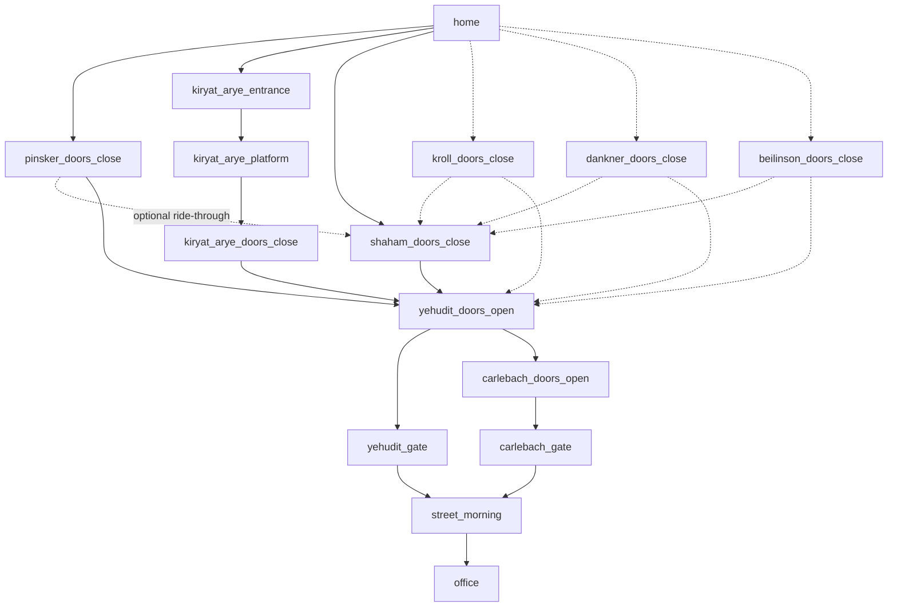
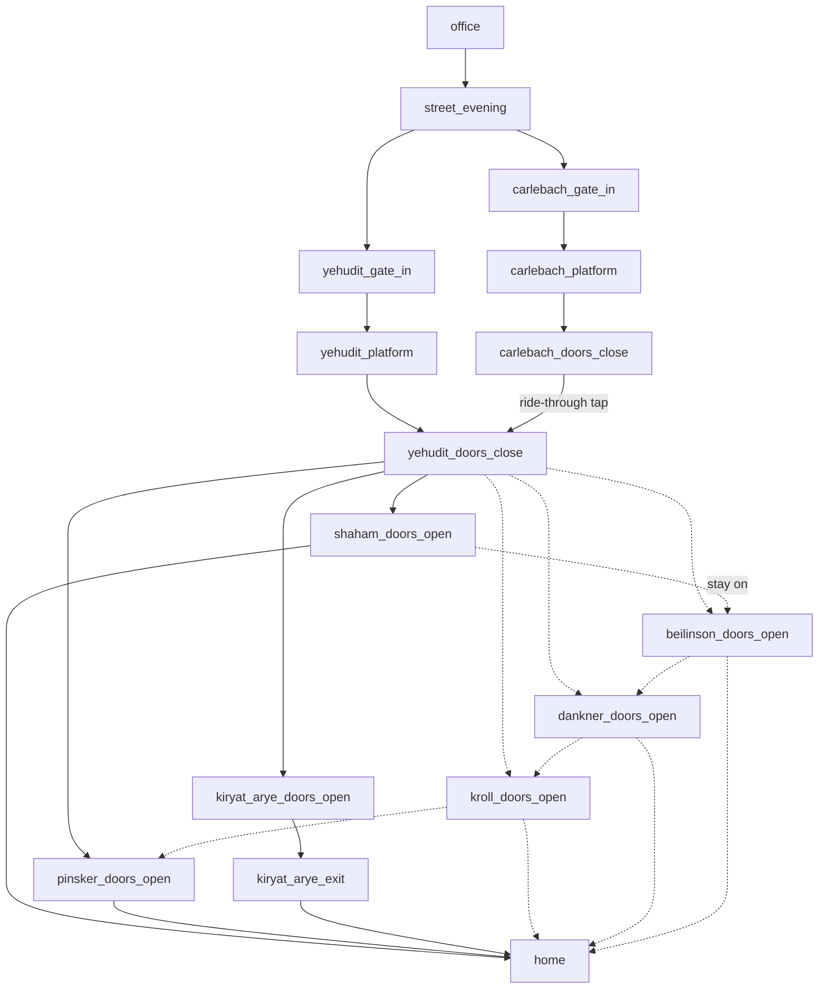

# Path Race — implementation spec

A personal commute experiment. One user (me), comparing alternative ways of commuting
between home (Petah Tikva) and the office (HaMelacha St, Tel Aviv) on the Dankal light
rail (Red Line), riding an electric scooter on every ground leg and taking it on the train.
The app is a mobile-web tap logger: I tap checkpoints as I pass them; the server stores
timestamps; a stats page compares options over time.

Implement end-to-end: backend, frontend, Docker deployment. No auth (protected only by an
unguessable URL path). Single user. Data loss is acceptable; friction is not.

---

## 1. Domain model

### 1.1 The network

Red Line service patterns: **R1** (Bat Yam ↔ Petah Tikva Central, via PT surface stops)
and **R3** (Elifelet ↔ Kiryat Arye). Both share the trunk through Tel Aviv, including
**Yehudit** and **Carlebach** (consecutive underground stations; from PT the train reaches
Yehudit first, then Carlebach).

Home-side boarding options (all reached by scooter from home):
- **Pinsker** (R1, closest, most street-running stops before the tunnel)
- **Kiryat Arye** (R3 terminus, deep station structure, board empty train)
- **Shaham** (R1, last surface stop before the tunnel — max stop-skipping)
- Reserve options (buttons exist, rarely used): **Kroll, Dankner, Beilinson** (R1)

R1 surface order toward the tunnel: Pinsker → Kroll → Dankner → Beilinson → Shaham → tunnel.

Office-side options: exit at **Yehudit** (earlier exit, longer scoot, one big variable-wait
intersection) or ride one more stop and exit at **Carlebach** (shorter scoot).

### 1.2 The two experiments (each measured in both directions)

| Experiment | Question | Bracket (morning) | Bracket (evening) |
|---|---|---|---|
| Boarding option | Which home-side station is fastest? | Home → Yehudit doors open | Yehudit doors close → Home |
| Office station | Yehudit or Carlebach? | Yehudit doors open → Office | Office → Yehudit doors close |

**Hinge principle:** only totals bracketed by taps shared across the compared options are
valid verdicts. "Yehudit doors open/close" is the main hinge — every trip passes it
regardless of choices. "Shaham doors close/open" is a secondary hinge shared by all
R1-family boardings (optional ride-through tap when boarding upstream of Shaham).
Intermediate segments are diagnosis ("why is it slower"), never the verdict.

One trip contributes to BOTH experiments (split at the Yehudit hinge).

### 1.3 Checkpoint graph (state machine)

The UI is: render the outgoing edges of the current node as tappable options. The path
taken infers all choices — no upfront declaration of line/station. Trip direction is
inferred from the first tap (Home → morning; Office → evening). Trip completes on the
terminal tap.

**Morning (Home → Office):**



Note: from a node like pinsker_doors_close the next valid taps are BOTH
shaham_doors_close (optional ride-through) and yehudit_doors_open (if the rider skips
the optional tap). Optional nodes must be skippable without any "skip" action — the graph
simply allows the edge that bypasses them.

Home-side segments before boarding: Pinsker/Shaham/reserve stops are curbside platforms —
scooter arrives essentially at the platform, so the boarding tap is just doors_close.
Kiryat Arye has internal structure worth diagnosing: entrance → platform → doors_close.

**Evening (Office → Home):**



Staying on past Shaham, the train continues along the surface stops in reverse
order: Beilinson → Dankner → Kroll → Pinsker. Each downstream doors_open is both
a valid alighting (followed by home) and an optional ride-through mark; on top
of the chain edges drawn above, skip edges exist from every surface doors_open
to every stop further downstream (e.g. shaham_doors_open → pinsker_doors_open
directly), so marking intermediate stations is never mandatory. The alighting
station for the boarding experiment is the last doors_open tapped before home.

The evening Carlebach branch requires a **ride-through tap** at "yehudit_doors_close" while
riding past — this is the hinge and is mandatory for the trip to count in the station
experiment (rider knows and accepts this).

Wait-time isolation: platform-arrival taps exist so wait (platform → doors_close) is
separable from ride and scoot segments, since train frequency differs per option
(Pinsker/Shaham see only R1; Kiryat Arye sees R3 and partial R2).

Define the graph as static config in code (single source of truth, both directions),
with checkpoint keys as above, display names in English, and an `optional` flag on
ride-through/reserve nodes for stats purposes.

## 2. Data model (SQLite)

```
trips: id (uuid), direction (morning|evening), started_at, completed_at,
       status (active|done|discarded), anomalous (bool, default false),
       anomaly_reason (text, nullable), crowding (int 1-3, nullable)
taps:  id (uuid, client-generated), trip_id, checkpoint_key, client_ts,
       seq (int, order within trip), ts_trusted (bool, default true),
       lat, lng, accuracy (all nullable)
```

- Client timestamps are authoritative (`client_ts` = device Date.now at tap commit).
  Server receipt time is meaningless (offline queue). Store server received_at only for
  debugging.
- Tap upload must be idempotent by tap id (retries from the offline queue must not
  duplicate).
- Derived, not stored (compute in queries/views): boarding_option and office_station
  inferred from which checkpoint keys appear in the trip's path.
- One active trip at a time; starting a new trip while one is active prompts to
  discard-or-complete the old one.

## 3. Tap UX (the critical part)

**Slide to commit.** Each checkpoint option is a slider (slide-to-unlock style), not a
button. Releasing in the cancel zone aborts; releasing past the commit threshold logs the
tap. After commit, a ~5-second undo toast; undo removes the tap and restores the previous
state. Multi-level undo is NOT needed mid-trip (slider prevents most errors); a single
post-commit undo suffices.

**Rapid-double-tap = timestamp invalidation.** If two consecutive taps commit less than
N seconds apart (N configurable, default 7s), the EARLIER tap keeps its place in the path
(needed for branch inference) but gets ts_trusted=false. Used when I forgot to tap on
time: I tap the missed checkpoint and the current one in quick succession. Segments
touching an untrusted timestamp are excluded from segment stats; bracket totals survive
if their endpoint taps are trusted.

**Ranked options, subtractive location filter.**
- Options for the current node are ranked by location plausibility and split into a main
  list and a collapsed "more…" fold. Location HIDES the obviously wrong (demotes below the
  fold) — it never removes an option and never auto-commits. If no GPS fix, stale fix, or
  low confidence (underground): filter silently off, static graph order.
- **Reorder only at:** trip start, tap commit, page `visibilitychange` → visible, and
  manual pull-to-refresh. Between those moments the layout is FROZEN — no live reshuffling
  under the thumb while GPS jitters.
- Log lat/lng/accuracy with each tap when available (audit data, costs nothing).
- Geolocation requires HTTPS (provided by the existing nginx/domain setup).

**Always reachable during a trip:** Discard trip (soft-delete; tap-and-hold-guarded —
press and hold ~1.2s until the fill completes, releasing early cancels; no extra confirm
dialog), crowding tag (1=seat, 2=stand-OK, 3=sardine; one tap, allowed anytime
after the first doors_close tap, overwritable), and a "mark anomalous" toggle with an
optional one-word reason (kept in data, excluded from averages by default — e.g. train
breakdown: bad timing data, still valid crowding data).

**Lifecycle / resilience:**
- Single-page mobile-first web app. Installable as PWA (manifest + icon) is a nice-to-have.
- Offline queue: taps commit to localStorage instantly and sync to the server whenever
  connectivity allows (tunnels, flaky cellular). The UI never blocks on the network.
- Cold reload (browser killed the tab) must restore mid-trip state instantly from
  localStorage — active trip, current node, pending queue — then reconcile with server in
  the background. Unlocking the phone must land on the right screen with zero taps.
- No polling/timers while backgrounded.

## 4. Stats page

Per experiment × direction (4 panels), computed over status=done, non-anomalous trips
(toggle to include anomalous):
- Per option: trip count, mean and median bracket total, avg crowding.
- Time-of-day split: same metrics grouped by departure-time window (configurable
  boundaries, default: before/after 08:30 for morning, before/after 18:00 for evening) —
  the same option at different hours is a different animal, in both time and crowding.
- Segment breakdown table per option (consecutive trusted-tap deltas, matched by
  checkpoint key — options have different checkpoint sets, so never match by position).
  Segments are diagnosis; visually subordinate to the bracket totals.
- A simple trip log (date, path taken, total, crowding, flags) with the ability to
  discard/undiscard and toggle anomalous from the desktop. No field editing of
  timestamps is required.

Keep it server-rendered-simple or a static page hitting JSON endpoints — whatever is
simplest to maintain. No charting library needed unless trivial to add.

## 5. API sketch

```
POST /api/trips                    -> create (first tap implies direction)
POST /api/trips/{id}/taps          -> idempotent tap upload (batch, from queue)
POST /api/trips/{id}/undo          -> remove last tap
PATCH /api/trips/{id}              -> crowding, status, anomalous, complete
GET  /api/state                    -> active trip + taps (for reconcile)
GET  /api/stats                    -> everything the stats page needs
GET  /api/trips?...                -> trip log
```

Exact shape is the implementer's choice; requirements are idempotency, batch tap sync,
and a single reconcile endpoint.

## 6. Deployment

- **FastAPI + SQLite**, uvicorn, Docker Compose (single service, volume-mounted DB file),
  runs on my home desktop server behind existing nginx with my domain (HTTPS already set
  up).
- Serve the whole app under a single unguessable path prefix, e.g.
  `/race-<random>/` — generate one and make it configurable via env var. Provide the
  nginx `location` snippet in the README; I will add it myself.
- No auth beyond the path. Single user.

## 7. Non-goals

- No accounts, no multi-user, no admin UI for editing the graph (it's code/config).
- No mid-trip timestamp editing UI; no desktop "correction" workflows beyond
  discard/anomalous toggles.
- No native app, no push notifications, no background GPS tracking.

## 8. Parameters to expose in config

- Double-tap invalidation threshold N (default 7s)
- Undo toast duration (default 5s)
- Location-filter confidence/accuracy thresholds and fold size
- Time-of-day split boundaries
- URL path prefix, port, DB path
